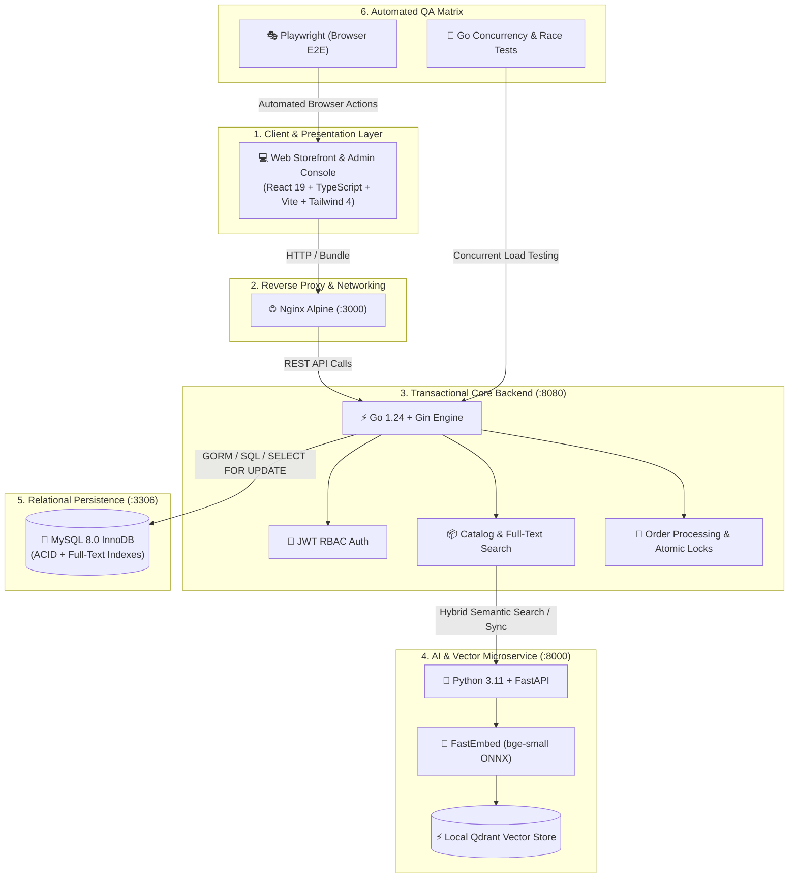

# 🛍️ Tirenn Commerce - Technology Stack & Architectural Decisions

> **Document Version**: 1.0.0  
> **Last Updated**: August 2026  
> **Project**: Tirenn Commerce (Modern E-Commerce Marketplace & AI Semantic Search)

---

## 🏛️ 1. Architecture Overview

Tirenn Commerce is architected as a **polyglot, high-performance distributed e-commerce platform**. It cleanly separates **high-throughput transactional processing (Go)**, **AI vector retrieval and semantic intelligence (Python)**, **minimalist high-converting storefront UI (React)**, and **ACID-compliant persistence (MySQL)**.

---

## 💻 2. Layer-by-Layer Technology Stack & Rationale

### A. Frontend Presentation Layer

| Technology | Role | Why We Chose It |
| :--- | :--- | :--- |
| **React 19** | Core UI Component Library | Industry standard, declarative component model, efficient reconciliation engine, and extensive ecosystem. |
| **TypeScript 5.x** | Static Typing | Eliminates runtime `undefined` bugs, provides full autocomplete across API DTO contracts, and enhances developer velocity. |
| **Vite 6** | Build Tool & Bundler | Instant hot module replacement (HMR) during development, blazing-fast Rollup production bundling, and lightweight distribution (~270 KB gzipped). |
| **Tailwind CSS v4** | Styling & Design System | Utility-first, zero runtime CSS overhead, modern design tokens, high maintainability, and clean responsive layout primitives. |

---

### B. Core Transactional Backend Layer

| Technology | Role | Why We Chose It |
| :--- | :--- | :--- |
| **Golang 1.24+** | Core Backend Language | **Microsecond execution latency**, low memory footprint, compiled static binary, superior goroutine concurrency model, and type safety. |
| **Gin Framework** | HTTP Router & Middleware Engine | Lightweight, high-performance HTTP web framework with minimal memory allocations per request, built-in CORS, and middleware chaining. |
| **GORM** | Object Relational Mapper | Type-safe query building, automatic table migrations, connection pooling, and preloading relations without manual boilerplate. |
| **Goose** | Database Migration Tool | Deterministic, version-controlled SQL migrations with bidirectional `up` and `down` rollback capabilities. |
| **Viper** | Configuration Loader | 12-factor app compliance: automatically loads configurations from environment variables, `.env` files, and defaults with zero code coupling. |
| **JWT (golang-jwt)** | Stateless RBAC Authentication | Secure, signed authorization tokens with zero database lookups required on authenticated routes. Separates `ADMIN` and `CUSTOMER` roles cleanly. |

---

### C. AI & Vector Semantic Search Microservice

| Technology | Role | Why We Chose It |
| :--- | :--- | :--- |
| **Python 3.11** | AI Service Runtime | The global standard for Artificial Intelligence, data manipulation, and vector embedding operations. |
| **FastAPI + Uvicorn** | Async Web Framework | Asynchronous non-blocking request handling, automatic OpenAPI/Swagger documentation (`/docs`), and native Pydantic v2 validation. |
| **FastEmbed (ONNX)** | Local CPU Vector Embedder | Runs **100% locally on CPU in < 5ms**. Generates 384-dimensional dense embeddings without requiring external cloud API keys (zero token fees). |
| **Qdrant Client** | Vector Database Engine | High-speed Cosine distance similarity indexing with payload metadata filters and score thresholding (`score_threshold = 0.65`). |

---

### D. Data Persistence & Indexing Layer

| Technology | Role | Why We Chose It |
| :--- | :--- | :--- |
| **MySQL 8.0 (InnoDB)** | Primary Relational Database | Strict ACID compliance, row-level locking (`SELECT FOR UPDATE`), foreign key cascading, and production battle-tested reliability. |
| **MySQL Full-Text Search (FTS)** | Lexical Search Engine | Native `FULLTEXT` indexing over `(name, description, sku)` enabling sub-millisecond keyword searches with boolean mode (`MATCH...AGAINST in BOOLEAN MODE`). |

---

### E. Quality Assurance & Testing Suite

| Technology | Role | Why We Chose It |
| :--- | :--- | :--- |
| **Playwright** | Browser E2E Automation | Tests real user-facing workflows (product search, cart drawers, modal interactions, admin role isolation, checkout) in Chromium. |
| **Go Test Suite** | Concurrency & Race Testing | Simulates 10 concurrent requests on a single inventory item to verify that zero overselling occurs under race condition loads. |
| **Automated Cleanup Hook** | Test Artifact Management | Automatically purges `test-results/` and report directories after test execution to keep the repository clean. |

---

### F. DevOps & Containerization

| Technology | Role | Why We Chose It |
| :--- | :--- | :--- |
| **Docker & Docker Compose** | Container Orchestration | Single command (`make docker-up`) to launch MySQL, AI Service, Go Backend, and React Frontend in an isolated bridge network. |
| **Nginx Alpine** | Frontend Web Server | Ultra-lightweight reverse proxy and static asset server with SPA fallback routing (`try_files $uri /index.html`). |
| **Multi-Stage Dockerfiles** | Image Size Optimization | Compiles binaries and builds bundles in temporary builder stages, resulting in minimal production runtime image sizes. |

---

## 🎯 3. Key Architectural Decisions & Trade-Offs

### 1. Why Separate Go (Core) and Python (AI)?
- **Problem**: Running CPU-heavy vector math and machine learning tokenizers inside the core transactional backend can stall HTTP request handling and delay customer checkout.
- **Solution**: We built a dedicated **Python AI Microservice (`ai-service/`)**. Go handles high-speed ACID database transactions and payments, while Python handles vector embeddings and semantic search.

### 2. Hybrid Search Strategy (Lexical FTS + Semantic Vector)
- **Lexical Full-Text Search (MySQL)**: Best for exact keyword searches, specific SKU lookups (`ELEC-001`), and exact brand names.
- **Semantic Vector Search (FastEmbed + Qdrant)**: Best for conceptual searches and intent discovery (e.g. *"alat dengar musik saat olahraga"* ➔ matches Headphone ANC & Wireless Earbuds).
- **Graceful Fallback**: If the AI service is offline, the Go backend automatically falls back to MySQL Full-Text Search with zero user disruption.

### 3. Concurrency Protection & Inventory Safety
- **Problem**: In flash sales or simultaneous checkouts, multiple shoppers might attempt to purchase the last item concurrently.
- **Solution**: Go database queries execute `SELECT stock_quantity FROM products WHERE id = ? FOR UPDATE` inside an ACID transaction. This acquires an atomic row lock in MySQL, guaranteeing zero negative stock.

---

## 📋 4. Service Port Allocation Map

| Service | Port | Protocol | Access Level | Description |
| :--- | :--- | :--- | :--- | :--- |
| **Frontend Web** | `3000` | HTTP | Public | Storefront UI & Admin Dashboard |
| **Core API Backend** | `8080` | HTTP / REST | Internal / Public | Go API, Auth, Orders, Products |
| **AI Semantic Service** | `8000` | HTTP / REST | Internal | FastAPI Vector Embedding & Search |
| **MySQL Database** | `3306` | MySQL TCP | Internal | Database Server |
