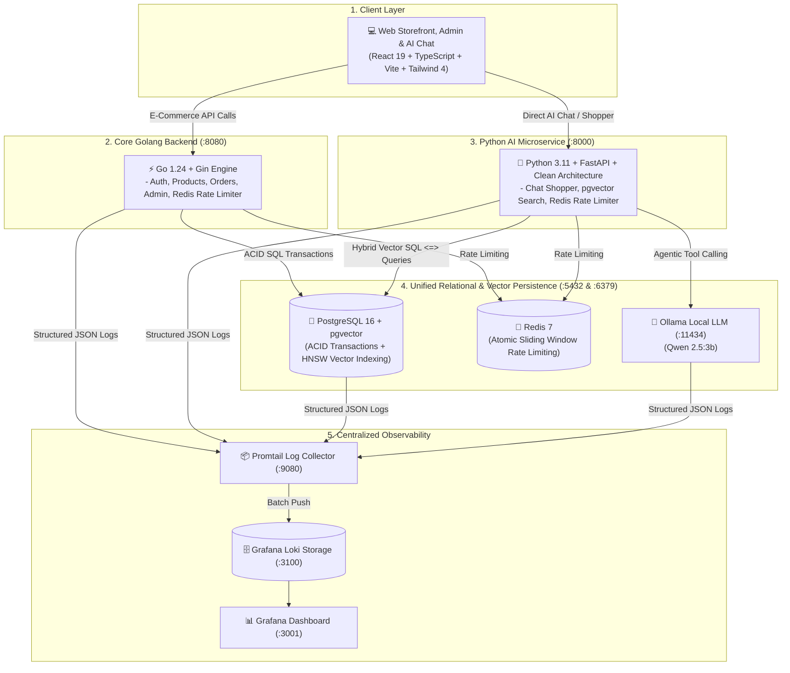

# 🛍️ Tirenn Commerce - Technology Stack & Architectural Decisions

> **Document Version**: 2.0.0  
> **Last Updated**: August 2026  
> **Project**: Tirenn Commerce (Modern E-Commerce Marketplace, Agentic AI Shopper, PostgreSQL + pgvector & Centralized Observability)

---

## 🏛️ 1. Architecture Overview

Tirenn Commerce is architected as a **polyglot, high-performance distributed e-commerce platform**. It cleanly separates **high-throughput transactional processing (Go)**, **AI vector retrieval and conversational shopping (Python + Ollama Qwen 2.5)**, **minimalist storefront UI (React)**, **unified ACID relational & vector persistence (PostgreSQL 16 + pgvector)**, and **centralized observability (Grafana Loki + Promtail)**.

---

## 💻 2. Layer-by-Layer Technology Stack & Rationale

### A. Frontend Presentation Layer

| Technology | Role | Why We Chose It |
| :--- | :--- | :--- |
| **React 19** | Core UI Component Library | Declarative component model, efficient reconciliation engine, and modern React 19 hooks. |
| **TypeScript 5.x** | Static Typing | Eliminates runtime `undefined` bugs, provides full autocomplete across API DTO contracts. |
| **Vite 6** | Build Tool & Bundler | Instant HMR during development, blazing-fast Rollup production bundling (~280 KB gzipped). |
| **Tailwind CSS v4** | Styling & Design System | Utility-first, zero runtime CSS overhead, modern design tokens, high maintainability. |
| **Conversational AI Modal** | Interactive Shopping Assistant | Lightweight Markdown rendering, product card previews with thumbnails, SKU badges, dynamic tool execution indicators, and **Reset Chat** support. |

---

### B. Core Transactional Backend

| Technology | Version | Purpose |
| :--- | :---: | :--- |
| **API Gateway & Core** | **1.25+** | Centralized API gateway, request tracing, JWT auth, and unified entrypoint for Frontend & AI tools. |
| **Distributed Cache & Rate Limiter** | **7-alpine** | Distributed sliding-window rate limiting middleware (120 req/min per IP) returning `429 Too Many Requests` & `X-RateLimit-*`. |
| **Primary Database & Vector Engine** | **16 (pgvector/pgvector:pg16)** | Single relational ACID database + Dense Vector Similarity Search using `HNSW` indexing. |
| **Frontend Web Client** | **18.x / 6.x** | Storefront UI, Admin Back-office, and Conversational AI Shopper calling exclusively Golang API (Port 8080). |
| **AI Intelligence Service** | **3.11 / 0.115** | Internal AI microservice for embeddings and agentic tool synthesis with Ollama. |

---

### C. Python AI & Semantic Search Microservice

The Python AI service adheres strictly to **Clean Architecture** (Handler ➔ UseCase ➔ Repository) mirroring the Golang backend:

| Layer | Component | Responsibility |
| :--- | :--- | :--- |
| **Delivery / Handlers** | [`chat_handler.py`](file:///c:/Users/Ryzen/Documents/Projects/ai-commerce/ai-service/app/handlers/chat_handler.py), [`catalog_handler.py`](file:///c:/Users/Ryzen/Documents/Projects/ai-commerce/ai-service/app/handlers/catalog_handler.py) | FastAPI endpoints, Pydantic request validation, and HTTP status handling. |
| **Business / UseCases** | [`shopper_usecase.py`](file:///c:/Users/Ryzen/Documents/Projects/ai-commerce/ai-service/app/usecases/shopper_usecase.py), [`search_usecase.py`](file:///c:/Users/Ryzen/Documents/Projects/ai-commerce/ai-service/app/usecases/search_usecase.py), [`sync_usecase.py`](file:///c:/Users/Ryzen/Documents/Projects/ai-commerce/ai-service/app/usecases/sync_usecase.py) | Autonomous agent loops, dynamic tool resolution, hybrid ranking algorithms, and catalog sync. |
| **Data / Repositories** | [`product_repository.py`](file:///c:/Users/Ryzen/Documents/Projects/ai-commerce/ai-service/app/repositories/product_repository.py), [`llm_repository.py`](file:///c:/Users/Ryzen/Documents/Projects/ai-commerce/ai-service/app/repositories/llm_repository.py), [`embedding_repository.py`](file:///c:/Users/Ryzen/Documents/Projects/ai-commerce/ai-service/app/repositories/embedding_repository.py) | Direct PostgreSQL queries, pgvector `HNSW` similarity search, Ollama HTTP client, and `SentenceTransformers`. |
| **Domain / Entities** | `domain/product.py`, `domain/chat.py`, `domain/category.py` | Core domain entities (`Product`, `ScoredProduct`, `ChatMessage`, `Category`). | State-of-the-art Indonesian & English reasoning, native JSON tool calling capabilities, running 100% locally in Docker. |
| **pgvector Native Search** | Unified Vector Similarity Engine | Directly executes Cosine Distance (`<=>`) queries inside PostgreSQL using high-speed `HNSW` indexing. |
| **Multilingual Vector Embedder** | High-Precision Semantic Engine | Runs on **`sentence-transformers/paraphrase-multilingual-MiniLM-L12-v2`** (384 dimensions, **~220MB**) with sharp cosine contrast separation and string-literal PostgreSQL pgvector serialization. |
| **Structured AI Audit Logging** | Response Audit Trail | Emits `AI_RESPONSE_LOG` for every chat turn capturing user prompts, tool arguments, database outputs, total latency, and full AI answers. |

---

### D. Unified Relational & Vector Persistence Layer

| Technology | Role | Why We Chose It |
| :--- | :--- | :--- |
| **PostgreSQL 16** | Primary Relational Database | Strict ACID compliance, row-level locking (`SELECT FOR UPDATE`), foreign key cascading, and battle-tested reliability. |
| **pgvector Extension** | Native Vector Storage | Replaces external vector databases (e.g. Qdrant) by storing 384-d embeddings directly as `vector(384)` column in `products`. Eliminates sync bugs and dual-write issues. |
| **HNSW Indexing** | Hierarchical Navigable Small World | Sub-5ms approximate nearest neighbor (ANN) vector search directly in SQL (`USING hnsw (embedding vector_cosine_ops)`). |

---

### E. Centralized Observability & Logging Stack

| Technology | Role | Why We Chose It |
| :--- | :--- | :--- |
| **Grafana Loki 3.0** | Centralized Log Storage | Ultra-lightweight (~50MB RAM), Prometheus-style label indexing, and LogQL search query support. |
| **Grafana Promtail 3.0** | Container Log Shipper | Automatically reads `stdout`/`stderr` from all Docker containers via the Docker socket and ships formatted streams to Loki. |
| **Grafana Dashboard** | Observability UI (:3001) | Pre-configured with Loki datasource for real-time live tailing, error filtering, and request ID correlation. |

---

### F. Quality Assurance & Testing Suite

| Technology | Role | Why We Chose It |
| :--- | :--- | :--- |
| **Playwright** | Browser E2E Automation | Tests real user-facing workflows (product search, cart drawers, modal interactions, admin role isolation, checkout) in Chromium. |
| **Go Test Suite** | Concurrency & Race Testing | Simulates 10 concurrent requests on a single inventory item to verify that zero overselling occurs under race condition loads. |
| **Automated Cleanup Hook** | Test Artifact Management | Automatically purges `test-results/` and report directories after test execution to keep the repository clean. |

---

## 🎯 3. Key Architectural Decisions & Patterns

### 1. Unified Database Pattern (PostgreSQL + pgvector)
- **Problem with Split DB (MySQL + Qdrant)**: Dual-write sync issues, two database clusters to back up, stale search results if background workers fail.
- **Solution with pgvector**: Vectors live in the same row as product metadata (`products.embedding`). Product updates and vector updates happen in the same atomic database transaction.

### 2. Zero-Bloat Observability Pattern (12-Factor App)
- Applications never manage log files or network syslog connections directly.
- **Go Backend** outputs `HTTP_ACCESS_LOG` and `APP_LOG` to `stdout`.
- **Python AI Service** outputs `AI_RESPONSE_LOG` to `stdout`.
- **Promtail** intercepts container streams and ships them to **Loki**, visualized on **Grafana (`:3001`)**.

### 3. End-to-End Tracing via Request ID
- Every HTTP request receives a unique `X-Request-ID`.
- It is propagated across Go `context.Context` from Handler to UseCase to Repository.
- In Grafana, typing `{container="tirenn-backend"} |= "req-xxxxx"` exposes the exact journey and errors for that specific request.

---

## 📋 4. Service Port Allocation Map

| Service | Port | Protocol | Access Level | Description |
| :--- | :--- | :--- | :--- | :--- |
| **Frontend Web** | `3000` | HTTP | Public | Storefront UI & Admin Dashboard |
| **Grafana Dashboard** | `3001` | HTTP | Admin (`admin`/`admin`) | Centralized LogQL & Observability UI |
| **Core API Backend** | `8080` | HTTP / REST | Internal / Public | Go API, Auth, Orders, Products |
| **AI Semantic Service** | `8000` | HTTP / REST | Internal | FastAPI Conversational Shopper & Vector Search |
| **PostgreSQL + pgvector** | `5432` | Postgres TCP | Internal | Unified Relational & Vector Database |
| **Grafana Loki** | `3100` | HTTP | Internal | Log Aggregation Engine |
| **Promtail Shipper** | `9080` | HTTP | Internal | Container Log Shipper Agent |
| **Ollama LLM** | `11434` | HTTP / REST | Internal | Local Qwen 2.5:3B LLM Engine |
